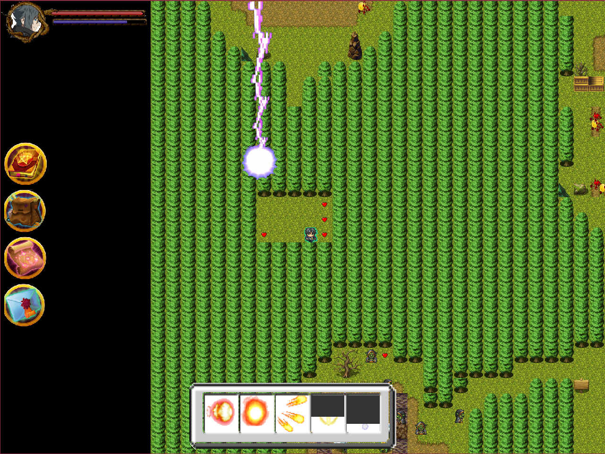
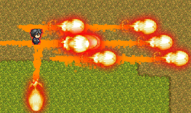
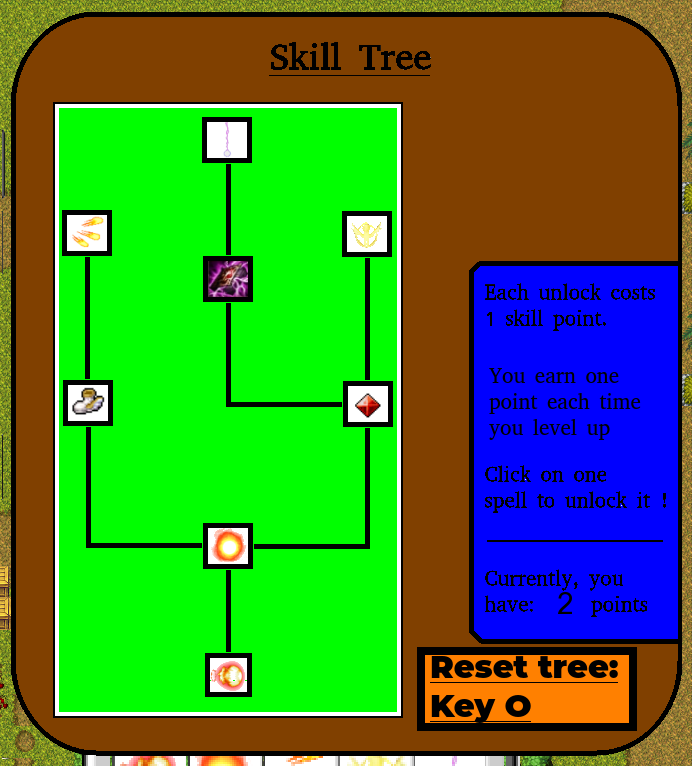
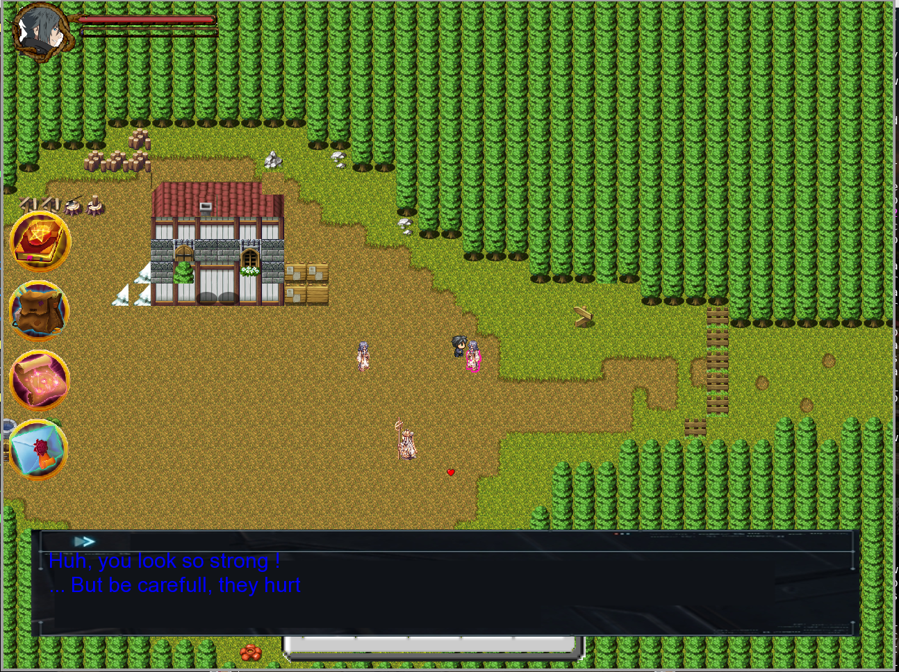
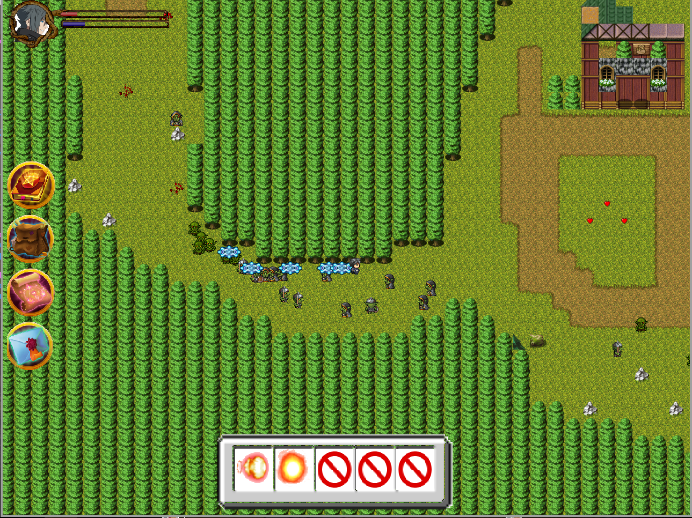
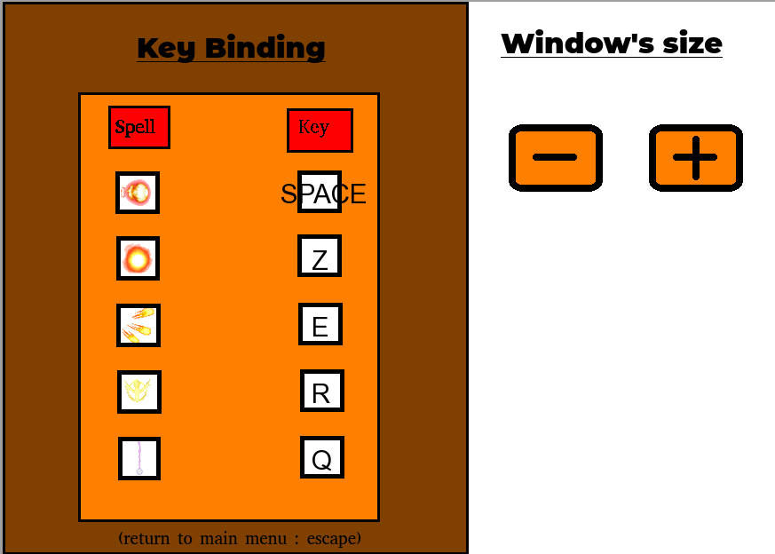
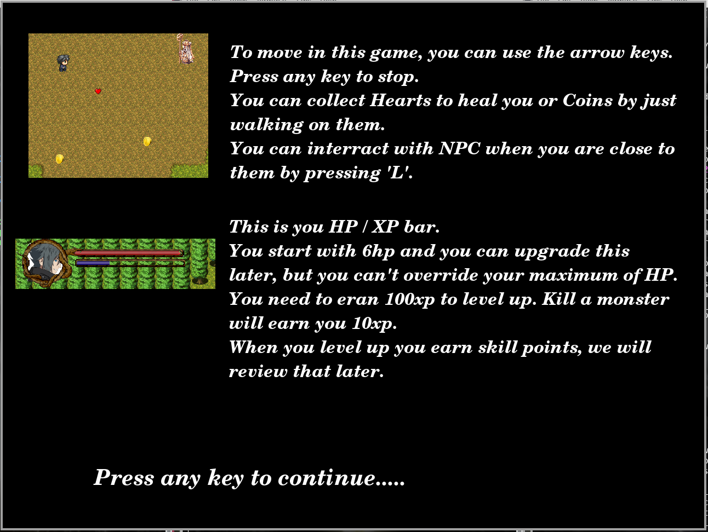
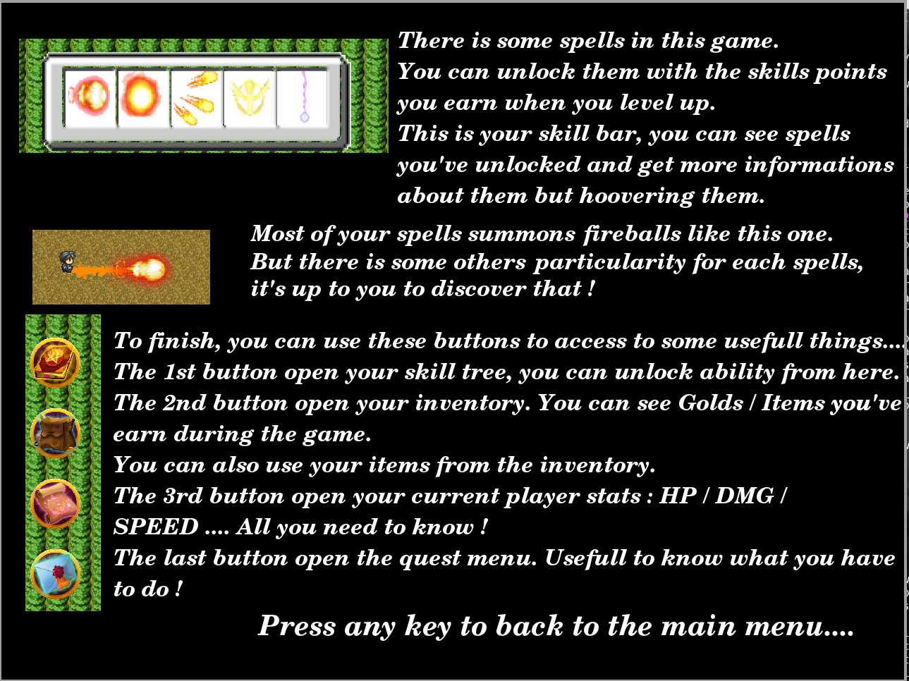

# my_rpg_2017
1 month project: create my own RPG. Made with the CSFML library

There are alot things that i would do differently now.
However, i learned alot about CSFML, shaders, game management (optimisation, data structures, ..).
And yeah, it's still a fun project !

In-game maps are load from maps/map_bg and maps/map_objects.
They have been created using Tiled.
I don't post screenshot about all in-game features to keep the suspense !

Bugs:
Resize isn't handle correctly on skill tree.
Sometimes potions don't go in your inventory..

Please have fun <3
(If you liked it, please star this repo !)

